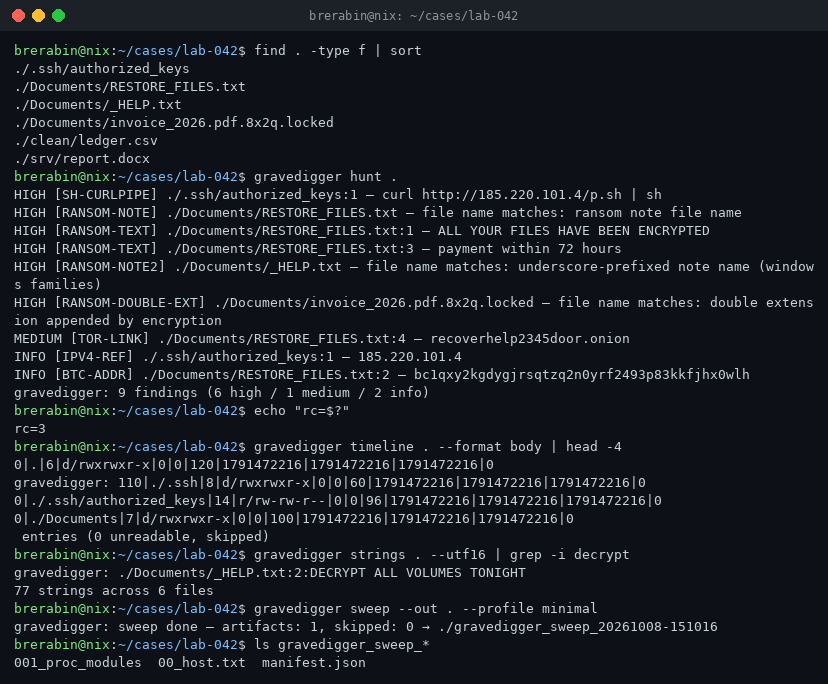

# gravedigger

first-hour forensic triage for unix hosts. one binary, no agent, no platform.

when a box goes sideways — ransom note on a share, a cron entry nobody wrote,
ssh keys that changed overnight — the first hour decides whether you
reconstruct the incident or lose it. gravedigger does the five things that
matter in that hour, in one pass, with output a machine can chew on and a
human can read.



## why

incident response tooling in the current crop is either a platform (agents,
databases, dashboards — none of which are on the box that's burning) or a
windows collector. linux and bsd hosts still get handed a for loop and
grep. gravedigger is the opposite bet: a single static binary you can scp
from your pocket, run from a read-only mount, and delete afterwards. it
collects, it reports, it leaves nothing behind and phones nothing home.

## commands

### timeline — filesystem chronology, mactime body format

```
$ gravedigger timeline /mnt/evidence --format body > super.body
0|./etc/passwd|410511|-/rw-r--r--|0|0|3421|1763941221|1763820045|1763941221|0
0|./var/tmp/.cache|412009|d/rwxr-xr-x|1000|1000|4096|1763941300|1763941300|1763941300|0
```

the body format loads straight into `mactime`, log2timeline, or Timeline
Explorer — your existing super-timeline workflow, minus the collection
step. `--json` and `--csv` are there when the body format isn't.
`--since`/`--until` bound the window; `--hash` fills the md5 column at the
cost of reading every file.

### hash — recursive digesting with known-bad matching

```
$ gravedigger hash /mnt/evidence --against iocs.txt --format text
9f2b...e1  /mnt/evidence/srv/.backup/rev.bin
gravedigger: 14832 files hashed (sha256), 1 known-bad matches, 3 skipped
$ echo $?
3
```

output is `sha256sum`-shaped, so it pipes. give it a hash list (one hex
digest per line, `#` comments) and it exits 3 on any hit — trivial to wire
into a pipeline or a cron.

### strings — ascii and utf-16le extraction

```
$ gravedigger strings . --utf16 | grep -i decrypt
./Documents/_HELP.txt:2:DECRYPT ALL VOLUMES TONIGHT
```

plain `strings(1)` misses utf-16le, which is exactly where windows-authored
ransom notes and dropper configs live. min length, size caps and json
output are flags, not afterthoughts.

### hunt — ransomware IOC sweep

scans file names, paths and content against a built-in rule pack:

| rule                  | severity | catches                                     |
|-----------------------|----------|---------------------------------------------|
| RANSOM-NOTE / NOTE2   | high     | restore/decrypt/readme-style note names     |
| RANSOM-EXT            | high     | known family extensions (.phobos, .mallox…) |
| RANSOM-DOUBLE-EXT     | high     | `invoice.pdf.8x2q.locked` style renaming    |
| SUSP-SYSTEM-EXE-IN-TMP| high     | svchost.exe dropped in /tmp or friends      |
| RANSOM-TEXT           | high     | "your files have been encrypted" boilerplate|
| VSS-WIPE              | high     | shadow copy destruction commands            |
| SH-CURLPIPE           | high     | `curl … \| sh` one-liners                   |
| PS-ENCODED            | medium   | base64 `-encodedcommand` payloads           |
| TOR-LINK              | medium   | onion service references                    |
| BTC / XMR / ETH / IPV4| info     | wallet and host references for pivoting     |

extend it with your own json rules (`--rules rules.json`) — same schema,
your regexes. exit 3 when high or medium trips; info never wakes you up.

### sweep — live-response artifact collection

```
$ gravedigger sweep --out /mnt/evidence --profile minimal
gravedigger: sweep done — artifacts: 12, skipped: 3 → /mnt/evidence/gravedigger_sweep_20261008-150901
```

collects shell histories, authorized_keys, crontabs, cron drop-ins, systemd
units, launchd plists, `/etc/ld.so.preload`, loaded modules, recent /tmp
entries and (profile `full`) log tails into a report directory. every file
is recorded in `manifest.json` with source, size and sha256 — chain of
custody from the first minute. read-only on the host; the only thing it
writes is the report.

profiles: `minimal` (identity, persistence, cron), `standard` (+ temp
dirs, recent /etc churn), `full` (+ logs).

## exit codes

| code | meaning                                  |
|------|------------------------------------------|
| 0    | clean / success                          |
| 1    | runtime error                            |
| 2    | sweep on a non-unix build                |
| 3    | findings (hunt) or known-bad hits (hash) |

## build

```
cargo build --release
```

a fully static linux build (glibc-less environments, rescue images):

```
rustup target add x86_64-unknown-linux-musl
cargo build --release --target x86_64-unknown-linux-musl
```

## honest scope

gravedigger collects and detects; it does not kill processes, quarantine
files or roll back encryption. it assumes unix; windows is not supported
(yet). content rules see a lossy utf-8 view, so heavily packed binaries
will only trip on names and paths — pair it with your EDR for that layer.
it is a scalpel for the first hour, not a replacement for a real IR
platform once the incident outgrows one box.

## license

MIT. run it on systems you're authorized to touch.
